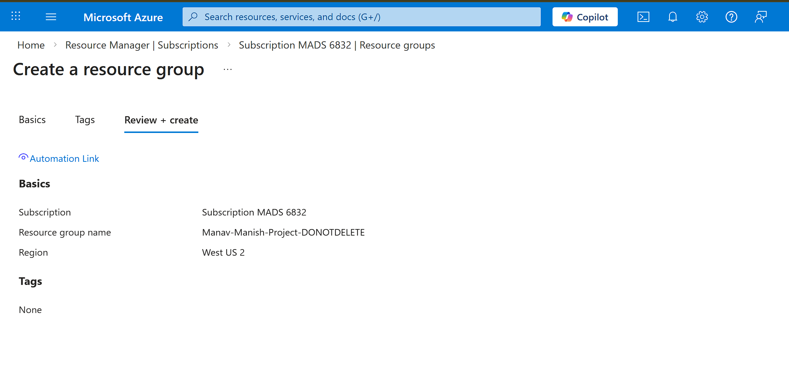

# SOC Alert Triage Classifier using Azure AI Foundry

## Overview
This project demonstrates how Azure AI Foundry can be used to build a **SOC-aligned text classification model** for alert triage. The model was trained with **Conversational Language Understanding (CLU)** to classify short security alert descriptions into the following categories:

- phishing
- brute_force
- malware
- reconnaissance
- benign

The goal of this project was to simulate a **SOC Level 1 triage workflow** by automatically categorizing alert text so that analysts can understand the likely type of activity more quickly.

---

## Why I Built This Project
I built this project to create something directly aligned with a **SOC Analyst role** instead of a generic AI demo. In a real SOC environment, analysts review alert descriptions, identify the likely threat type, and prioritize investigation. This project helped me combine:

- SOC alert triage thinking
- threat category recognition
- Azure AI Foundry hands-on experience
- practical AI application in security operations

This project is not meant to replace a SIEM. Instead, it shows how AI can support the **triage layer** after alerts are generated.

---

## Project Objectives
- Build a text classification model for SOC-style alert descriptions
- Train the model in Azure AI Foundry using CLU
- Deploy the trained model for live testing
- Validate whether the model can correctly classify security alert text
- Document the full build process for portfolio and interview discussion

---

## Technologies Used
- **Azure Portal**
- **Azure AI Foundry**
- **Conversational Language Understanding (CLU)**
- **JSON utterance dataset**
- **GitHub**

---

## Classification Labels
The model was trained on five SOC-relevant intents:

- **phishing** - suspicious emails, malicious links, spoofed senders, credential harvesting, suspicious attachments
- **brute_force** - repeated login failures, password spraying, credential guessing, authentication attacks
- **malware** - suspicious process execution, PowerShell abuse, macros, payload delivery, unauthorized binaries
- **reconnaissance** - scanning, port enumeration, discovery activity, probing multiple systems
- **benign** - approved scans, normal admin activity, routine maintenance, expected user behavior

---

## Project Workflow

### 1. Created Azure Resource Group
I started in the **Azure Portal** by creating a dedicated **Resource Group** for the project. This helped keep all project resources organized in one place.



### 2. Created Azure AI / Microsoft Foundry Resource
After creating the resource group, I created the **Microsoft Foundry / Azure AI Foundry** resource that would be used to build the language understanding project.


### 3. Opened Azure AI Foundry and Created the Project
Inside Azure AI Foundry, I created a new project for the classifier.

- **Project name:** `classifying-alerts`
- **Task type:** Conversational Language Understanding

This project was designed specifically for **security alert classification**.


### 4. Defined the Schema (Intents)
In the **Define schema** section, I created five intents that represent common SOC triage categories:

- phishing
- brute_force
- malware
- reconnaissance
- benign

These intents are the labels the model uses when classifying input text.


### 5. Prepared the Utterance Dataset
I created a labeled JSON utterance file containing training and testing examples for each intent.

The dataset included examples such as:
- phishing-related credential reset emails
- brute force authentication attempts
- malicious PowerShell execution
- reconnaissance scanning behavior
- benign scheduled vulnerability scanning

For transparency and reproducibility, I included the utterance files in this repository.

**Dataset files:**
- `data/soc_clu_utterances.json`
- `data/soc_clu_utterances_en.json`

### 6. Uploaded Utterance File in Manage Data
In the **Manage data** section, I uploaded the JSON utterance file to Azure AI Foundry so the project could use it for training and testing.


### 7. Trained the Model
In the **Train model** section, I created a new training model with the following setup:

- **Model name:** `soc-alert-triage-v1`
- **Training mode:** Standard training (free)

The model was then trained using the labeled SOC alert dataset.


### 8. Evaluated the Model
After training completed, I evaluated the model to confirm that it had learned the distinction between the five alert categories.

The evaluation focused on whether the model could correctly classify different SOC-style alert descriptions.


### 9. Deployed the Trained Model
Once training was complete, I deployed the model so it could be tested live.

- **Deployment name:** `soc-alert-triage-deployment`
- **Assigned model:** `soc-alert-triage-v1`


### 10. Tested the Live Deployment
After deployment, I tested the model in the Foundry interface with live alert descriptions.

Examples used during testing included:
- Microsoft 365 credential reset phishing email
- Administrator brute force attempt
- PowerShell execution from a downloaded Word document
- Internal host scanning multiple ports
- Approved vulnerability scanning during maintenance

The model successfully predicted all five categories during manual testing.


---

## Test Results
The deployed model correctly classified the following live test samples:

| Test Case | Predicted Intent | Confidence |
|---|---|---:|
| Microsoft 365 credential reset email | phishing | 86.55% |
| Multiple failed logins before one success | brute_force | 84.34% |
| PowerShell encoded command after Word document | malware | 90.96% |
| One internal host scanning multiple systems | reconnaissance | 79.65% |
| Approved vulnerability scanning during maintenance | benign | 86.95% |

### Summary
- All 5 manual test prompts were classified correctly
- Highest confidence: **malware (90.96%)**
- Lowest confidence: **reconnaissance (79.65%)**
- Reconnaissance had lower confidence because it can linguistically overlap with benign scanning activity

---

## Example Use Case
This project can be positioned as a simple AI-assisted triage layer for security operations. For example:

- A SIEM generates an alert
- The analyst or downstream process sends the short alert summary to the classifier
- The classifier predicts whether the activity looks like phishing, brute force, malware, reconnaissance, or benign activity
- The result can support faster categorization and prioritization

---

## Repository Structure
```text
SOC-Alert-Triage-Classifier/
│
├── README.md
├── data/
│   ├── soc_clu_utterances.json
│   └── soc_clu_utterances_en.json
└── screenshots/
    ├── 01-resource-group.png
    ├── 02-foundry-resource.png
    ├── 03-create-project.png
    ├── 04-define-schema.png
    ├── 05-upload-utterances.png
    ├── 06-train-model.png
    ├── 07-evaluate-model.png
    ├── 08-deploy-model.png
    ├── 09-test-phishing.png
    ├── 10-test-bruteforce.png
    ├── 11-test-malware.png
    ├── 12-test-reconnaissance.png
    └── 13-test-benign.png
```

---

## How to Reproduce
1. Create a Resource Group in Azure Portal
2. Create an Azure AI Foundry resource
3. Open Foundry and create a new CLU project
4. Define the five intents
5. Upload the JSON utterance file
6. Train a new model
7. Evaluate the model
8. Deploy the trained model
9. Test live alert descriptions

---

## Key Learning Outcomes
Through this project, I strengthened my understanding of:

- how SOC alert triage can be translated into a machine learning workflow
- how Azure AI Foundry handles schema, training data, model training, evaluation, and deployment
- how alert wording impacts classification confidence
- how AI can support analyst decision-making without replacing core SIEM functionality

---

## Future Improvements
- Expand the dataset with more utterances per class
- Improve separation between reconnaissance and benign scanning examples
- Add entity extraction for IP addresses, usernames, hostnames, or file names
- Integrate with a SIEM or case management workflow for a more realistic pipeline
- Create a small front-end or API demo for easier testing

---

## Author
**Manav Sadyora**

Aspiring SOC Analyst focused on blue team operations, alert triage, incident investigation, and practical security projects.
